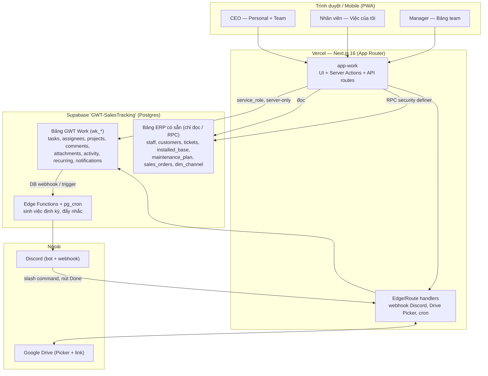
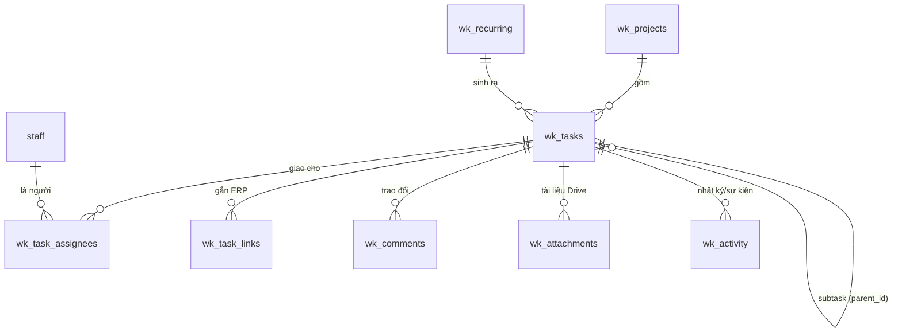

# Kế hoạch CTO — Xây hệ quản lý công việc cá nhân + team (GWT Work)

**Ngày:** 18/08/2026
**Người soạn:** CTO (đề xuất kiến trúc)
**Trạng thái:** Chờ duyệt định hướng
**Bối cảnh nền:**
- File cá nhân CEO: `Planning/Planning 2026.xlsx` (10 sheet: 2026 goals, Work-Week, Personal-Week, To-do, Daily, AI, Travel…)
- Module Sales: `Sales Tracking/gwt-sales` (Next.js 16 + Supabase)
- Module CSKH: `Customer Support/apps/web` + `db/cs` (production, ~336 khách, ~465 máy, ~90 ticket)
- Cùng 1 Postgres: Supabase `GWT-SalesTracking` (`bwzmqfbcgouhvhoslmmm`)

---

## 1. Tóm tắt điều hành (đọc phần này là đủ để quyết)

**Vấn đề:** Excel cá nhân tốt cho tư duy chiến lược của riêng CEO nhưng **rời rạc** khi mỗi nhân viên tự giữ 1 file. Asana thì **đắt theo đầu người + tách rời dữ liệu công ty** — không biết khách nào, đơn nào, ticket nào, nên không tự sinh việc và không báo cáo xuyên suốt được.

**Khuyến nghị (1 câu):** **Không mua Asana, không dựng app đứng riêng.** Xây module **GWT Work** *bên trong chính hệ ERP Supabase đang có* — dùng chung database, chung đăng nhập, chung bảng `staff`/`customers`/`tickets`. Khi đó yêu cầu số 4 ("chia việc theo 1 khách hàng, gắn báo giá / hợp đồng / lịch lắp đặt / ticket") **trở thành khoá ngoại (FK), không phải tích hợp API mong manh.** Đây là lợi thế mà không SaaS nào ngoài kia có được với dữ liệu của GWT.

**Vì sao build thắng buy ở đúng ca này:**

| Tiêu chí | Asana / SaaS ngoài | GWT Work (native module) |
|---|---|---|
| Gắn việc vào 1 khách/đơn/ticket | Chỉ link text, không join được | **FK thẳng** `customer_code`, `ticket_id`, `order_code` |
| Tự sinh việc từ sự kiện ERP | Không (không thấy data) | Có: đơn mới → việc kích hoạt BH; máy lắp → việc lên lịch bảo trì; ticket mới → việc xử lý |
| Báo cáo xuyên suốt (việc ↔ doanh số ↔ CSKH) | Ghép tay | 1 câu SQL/1 dashboard |
| Chi phí biên | ~11 USD/người/tháng, tăng theo đầu người | **≈ 0** (đã trả Supabase + Vercel) |
| Đăng nhập / phân quyền | Hệ riêng | Dùng lại Google `@gwt.vn` + `staff.vai_tro` sẵn có |
| Data về sau (AI, chatbot nội bộ) | Kẹt trong Asana | Nằm trong Postgres của mình → nuôi AI được |

**Chi phí:** gần như chỉ tốn **thời gian dựng** (vibe-coding), không tốn thêm phí hạ tầng đáng kể. Discord free, Google Drive free, Supabase/Vercel đã có.

**Cần CEO chốt 3 việc** (chi tiết ở §12): (a) xác nhận project Supabase đích, (b) chọn Discord là kênh nhắc chính thức, (c) duyệt phạm vi MVP ở §9.

---

## 2. Nguyên tắc thiết kế (quyết định kiến trúc)

Kế thừa đúng "văn hoá kỹ thuật" đã dùng cho Sales/CS — không phát minh lại:

| Hạng mục | Quyết định | Lý do |
|---|---|---|
| Kiến trúc | **Module trong monorepo ERP**, Next.js 16 + Supabase + Vercel | Giống `gwt-sales`, `apps/web`; 1 stack, 1 đội bảo trì |
| Database | **Chung project `GWT-SalesTracking`**, GWT Work sở hữu bảng riêng (prefix `wk_`) | Join thẳng khách/ticket/đơn, không sync chéo |
| Ranh giới | Work chỉ **ĐỌC** bảng Sales/CS; **GHI** qua RPC `security definer` | Đúng luật đang áp: Sheet/CS là nguồn chân lý, không ghi đè |
| Đăng nhập | Supabase Auth **Google `@gwt.vn`**, gác cổng ở `requireStaff()` | Dùng lại nguyên `staff` (email, `vai_tro text[]`, `hoat_dong`) |
| Phân quyền | RLS theo `staff.vai_tro`; task cá nhân `private`, task team theo project/assignee | PII đã khoá RLS; task cá nhân của CEO không lộ cho nhân viên |
| Nhắc việc | **Discord** (bot + webhook) là kênh chính; email là phụ | Team đã dùng Discord; rẻ, real-time, có DM + channel |
| Tài liệu | **Google Drive** (link + Picker); quy ước 1 folder / 1 khách | Data đang nằm ở Drive/Sheets; không bê file vào DB |
| Chống lặp lỗi cũ | Test từ ngày 1, 1 công thức trạng thái, event log 1 đường | Đúng 10 bài học từ spec chatbot 21/07 |

**Tên sản phẩm/repo đề xuất:** `gwt-work` (app `app-work`, schema prefix `wk_`). Tên hiển thị: **GWT Work** (hoặc "Việc GWT").

---

## 3. Kiến trúc tổng thể

**Điểm cốt lõi:** GWT Work và ERP **chung một Postgres** → một câu `join` là ra "việc của khách KH00123 + ticket đang mở + đơn gần nhất". Không có tầng đồng bộ, không có độ trễ, không có lệch dữ liệu.

---

## 4. Mô hình dữ liệu (schema `wk_*`)

Thiết kế tối thiểu-đủ, mở rộng được. Prefix `wk_` để không đụng bảng Sales/CS.

**Bảng chính (mô tả cột then chốt):**

- **`wk_tasks`** — 1 dòng = 1 việc.
  `id, title, description, status` (`todo|doing|blocked|review|done|cancelled`), `priority` (`P1..P4`),
  `scope` (`personal|team`), `visibility` (`private|team|company`),
  `project_id`, `parent_id` (subtask), `creator_id` (staff), `due_at`, `start_at`, `completed_at`,
  `estimate_min`, `recurring_id`, `created_at`, `updated_at`.
- **`wk_task_assignees`** — junction *nhiều người 1 việc* (yêu cầu #1).
  `task_id, staff_id, role` (`owner|doer|reviewer|watcher`), `assigned_by`, `accepted_at, done_at`.
  → 1 việc có 1 `owner` (chịu trách nhiệm), N `doer` (cùng làm), `reviewer` (người giao/nghiệm thu), `watcher` (theo dõi, được báo cáo).
- **`wk_task_links`** — gắn việc vào thực thể ERP (yêu cầu #4). Hai cách, dùng cả hai:
  cột FK tường minh `customer_code, ticket_id, order_code, installed_base_serial, maintenance_plan_id` + 1 cột `link_type` (`sales_quote|sales_contract|sales_visit|cs_install|cs_ticket|cs_maintenance|internal`).
- **`wk_projects`** — nhóm việc. `id, name, kind` (`customer|campaign|internal|personal`), `customer_code?`, `owner_id`, `status`, `color`.
- **`wk_comments`** — `task_id, author_id, body, created_at` (+ `@mention` → nhắc Discord).
- **`wk_attachments`** — tài liệu Drive (yêu cầu #2). `task_id, drive_file_id, drive_url, name, mime, added_by`.
- **`wk_activity`** — **1 đường sự kiện duy nhất** (tạo, đổi trạng thái, giao thêm người, tới hạn…). Đây là nguồn để (a) đẩy Discord, (b) dựng báo cáo, (c) audit. Học đúng bài "data 1 đường + đếm sau nạp".
- **`wk_recurring`** — mẫu việc lặp lại. `title_tmpl, rrule` (chuẩn iCal RRULE), `default_assignees`, `link_tmpl`, `active`. Dùng cho "việc lặp lại của công ty" (sheet AI của CEO đã liệt kê sẵn: đổ muối, HDSD, lên lịch bảo trì, kích hoạt BH, báo giá, hợp đồng…) và cho routine cá nhân.
- **`wk_notifications`** — hàng đợi nhắc: `staff_id, task_id, kind, channel` (`discord|email|inapp`), `sent_at, read_at`. Idempotent.

**Bảo mật (RLS):**
- `wk_tasks.visibility='private'` → chỉ creator + assignee đọc (task cá nhân CEO an toàn tuyệt đối).
- `team` → thành viên project + assignee. `company` → mọi `staff.hoat_dong`.
- Manager (`vai_tro @> {sales_manager}` hoặc `{cs_manager}`, `{admin}`) đọc toàn bộ việc phòng mình.
- Ghi vào bảng ERP (vd tạo ticket từ task) chỉ qua **RPC `security definer`**, không ghi trực tiếp — đúng luật CS.

---

## 5. Yêu cầu #1 — Chia việc cho 1 hoặc nhiều người

- **Mô hình RACI nhẹ** qua `wk_task_assignees.role`:
  - `owner` = người chịu trách nhiệm chính (1 người, để không "cha chung không ai khóc").
  - `doer` = cùng thực thi (N người).
  - `reviewer` = người giao việc / nghiệm thu → **được báo cáo khi Done** (đúng yêu cầu #3).
  - `watcher` = theo dõi, không làm nhưng nhận thông báo.
- **Giao nhanh:** gõ `@tên` trong ô giao việc; chọn cả nhóm (theo `staff.vai_tro`, vd "cả team Sales HCM").
- **Chia nhỏ:** 1 việc lớn → nhiều `subtask` (`parent_id`), mỗi subtask giao người khác nhau; tiến độ cha = % subtask done.
- **"Việc của tôi":** mỗi nhân viên có 1 trang gộp mọi việc mình là `owner/doer` xuyên mọi project — thay thế đúng cái file Excel rời rạc hiện tại.

---

## 5b. Bổ sung theo tham khảo Asana (chốt 18/08/2026)

| Tính năng | Cách làm trong `work` | Ghi chú |
|---|---|---|
| **Subtask nhiều cấp** | `task.parent_id` (self-FK) | Tiến độ cha = % con hoàn thành |
| **Dependencies** (chặn/bị chặn) | `task_dependency(task_id, blocked_by_id)` | Chặn đánh Done khi việc tiền đề chưa xong; nuôi **Timeline view** |
| **Create follow-up task** | `task.follow_up_from` + RPC `create_follow_up` | Task mới copy khách/assignee từ task gốc |
| **Merge duplicate** | `task.duplicate_of` + `merged_at` + RPC `merge_tasks` | Dời assignee/link/comment/subtask sang bản giữ lại |
| **1 task ∈ nhiều project** ✅ | `task_project` (bảng nối nhiều-nhiều = *multi-home*) | Vd 1 clip vừa ở bảng **Kỹ thuật** vừa ở project **Podcast nước** — không nhân bản |
| **Bảng theo team** (Marketing/Sales/CSKH/Kỹ thuật) ✅ | `team` + `team_member` | Cty nhỏ → 1 người **thuộc nhiều team**, nhìn nhiều bảng; task multi-home nên 1 việc hiện ở nhiều bảng |
| **Chia theo project** (build app, series podcast nước…) ✅ | `project.kind='initiative'` | Project xuyên team hoặc thuộc 1 team |
| **4 chế độ xem: List · Board · Calendar · Timeline** ✅ | Cùng bảng `work.task`; Calendar/Timeline đọc `start_at`/`due_at`, Timeline thêm `task_dependency` | List+Board ở GĐ0–1; Calendar+Timeline ở GĐ1–2 |

Toàn bộ đã đưa vào migration GĐ0 — xem [../db/work/migrations/work_00_init.sql](../GWT%20Work/db/work/migrations/work_00_init.sql).

## 6. Yêu cầu #2 — Kết nối Google Drive (lấy tài liệu)

**MVP (rẻ, nhanh, đủ dùng):**
- Nút **"Đính kèm từ Drive"** dùng **Google Picker** (đăng nhập Google đã có sẵn cho `@gwt.vn`) → chọn file → lưu `drive_file_id` + `drive_url` + tên vào `wk_attachments`. Mở file = click link, phân quyền do Drive quản.

**Nâng cao (giai đoạn sau):**
- **Quy ước 1 folder / 1 khách** trên Drive (đặt tên theo `customer_code`/tên khách). Khi mở 1 việc gắn khách → app tự **liệt kê file trong folder khách đó** (Drive API `files.list` bằng service account hoặc OAuth token của người dùng).
- Kéo tự động: đơn/hợp đồng/báo giá xuất ra Drive → gắn luôn vào task tương ứng.
- Ghi chú: đội đã có kinh nghiệm **Google Apps Script** (`GWT_Catalog_Mirror_AppsScript.gs`) + Drive MCP → không phải học mới.

---

## 7. Yêu cầu #3 — Kết nối Discord (nhắc việc & báo cáo)

**Cơ chế:** `wk_activity` sinh sự kiện → **Supabase DB webhook / trigger** gọi **Edge Function** → gọi **Discord** (bot hoặc webhook URL). Chiều ngược lại: nút/slash command trong Discord → route handler của `app-work` → cập nhật task.

**Các sự kiện nhắc (đúng yêu cầu):**

| Sự kiện | Ai nhận | Kênh |
|---|---|---|
| **Task mới được giao** | `owner` + `doer` | Discord DM + ping trong channel phòng |
| **Task hoàn thành** | `reviewer` (người giao) + `watcher` + các `doer` cùng việc | DM người giao + post vào channel |
| Sắp tới hạn / quá hạn | assignee + (quá hạn) manager | DM + channel |
| `@mention` trong comment | người được nhắc | DM |
| Digest sáng | từng người: "hôm nay bạn có N việc" | DM 8h sáng (pg_cron) |
| Digest phòng | manager/CEO: tiến độ phòng | channel cuối ngày |

**Ánh xạ người:** thêm cột `staff.discord_id` (hoặc bảng `wk_staff_channel`). Nút **"Xong"** ngay trong tin Discord → đánh dấu done không cần mở web.

**Vì sao Discord hợp:** team đang dùng; miễn phí; DM + channel tách bạch việc cá nhân vs phòng ban; bot tự host trên chính Edge Function, không thêm SaaS.

---

## 8. Yêu cầu #4 — Kết nối vào ERP (Sales / CSKH)

Đây là **lý do build thắng buy**. Vì chung Postgres, việc "chia việc chăm sóc theo 1 khách hàng" là FK, không phải tích hợp.

**8.1. Gắn việc vào thực thể có thật (đọc thẳng):**
- Chọn khách → `wk_task_links.customer_code` (`KH00001`). Mở task thấy luôn **chân dung khách 360**: đơn đã mua (`customer_purchases`), máy đã lắp (`installed_base`), bảo hành (`warranty`), ticket (`tickets`), lịch bảo trì (`maintenance_plan`).
- Loại việc Sales: **báo giá / hợp đồng / đi gặp khách** → `link_type=sales_quote|sales_contract|sales_visit`, gắn `order_code` nếu có.
- Loại việc CSKH: **lịch lắp đặt kỹ thuật / xử lý ticket** → `link_type=cs_install|cs_ticket|cs_maintenance`, gắn `ticket_id` / `maintenance_plan_id` / `installed_base_serial`.

**8.2. Tự sinh việc từ sự kiện ERP (điểm ăn tiền — Asana không làm được):**

| Sự kiện trong ERP | Việc tự tạo | Giao cho |
|---|---|---|
| Đơn mới chốt (Sales) | "Kích hoạt bảo hành + tạo hồ sơ CS" | CS |
| `installed_base` có máy mới | "Lên lịch lắp đặt/kỹ thuật" rồi "Lên lịch bảo trì định kỳ" | Kỹ thuật |
| `tickets` mới mở | "Xử lý ticket #… cho khách…" | CSKH |
| `maintenance_plan` tới hạn thay lõi/đổ muối | "Nhắc CS gọi khách + đặt lịch" | CSKH |
| Bảo hành sắp hết | "Chào gia hạn/bán gói bảo trì" | Sales |

→ Làm bằng **trigger `AFTER INSERT/UPDATE`** trên bảng ERP hoặc **view `v_*_cho_lam` + pg_cron** quét định kỳ (giống cách CS đã có `v_bh_cho_kich_hoat`). Idempotent, không tạo trùng.

**8.3. Ghi ngược an toàn:** nếu từ task muốn tạo ticket/kích hoạt BH → gọi RPC có sẵn (`activate_and_seed`, `activate_warranty`) chứ không `INSERT` thẳng — giữ đúng ranh giới sở hữu module.

---

## 9. Hai chế độ dùng: Cá nhân (CEO) + Team

App một chỗ, hai "lớp":

**A. Team / Company (thay Asana & Excel rời rạc):**
Bảng việc theo phòng, theo khách, theo dự án; "Việc của tôi"; báo cáo tiến độ; nhắc Discord.

**B. Personal (giữ nguyên "nghi thức" chiến lược của CEO — đây là thứ Excel đang làm tốt, phải bảo tồn):**
Map thẳng cấu trúc file `Planning 2026.xlsx`:
- **Goals 2026** (sheet `2026`) → module Mục tiêu năm (3 most important + ultimate goals + "what to improve").
- **Work-Week / Personal-Week** → nhịp **Weekly / Monthly / Quarterly** (đúng cột đã có), kèm khối *Reflection* (big wins / learned).
- **To-do / Daily** → lịch ngày + "Strategic Container", "Deep/Shallow Work" (đúng sheet `Daily` và `Nguyên tắc`).
- **AI** → nơi khai báo *việc lặp lại của công ty* + *việc muốn AI làm* (đã liệt kê sẵn) để sinh `wk_recurring`.
- Task cá nhân để `visibility='private'` → nhân viên/không ai thấy.

Nhờ chung hệ: một việc team ("gặp khách Trang Bùi") có thể **hiện trong lịch cá nhân** của CEO mà vẫn gắn với khách trong ERP. Excel không làm được điều này.

---

## 10. Lộ trình theo giai đoạn

Ước lượng theo tốc độ vibe-coding của đội (1 người chính + CEO review). "tuần" = tuần-người ước chừng, không phải cam kết.

| GĐ | Phạm vi | Kết quả dùng được | Ước lượng |
|---|---|---|---|
| **0 — Khung** 🚧 | Repo `GWT-App`, schema `work` + RLS (✅ migration xong), auth Google `@gwt.vn`, CRUD task + "Việc của tôi" | Nội bộ tạo/giao/đánh dấu việc trên web | ~1–1.5 tuần |
| **1 — Team core** | Multi-assignee (RACI), project, subtask, comment/@mention, bảng team, bộ lọc/tìm | Thay được Excel rời rạc của nhân viên | ~1.5–2 tuần |
| **2 — Discord** | Bot + webhook: nhắc giao việc, báo cáo Done, digest sáng, nút Done | Đúng yêu cầu #3 | ~1 tuần |
| **3 — ERP link** | Gắn task vào khách/ticket/đơn; chân dung 360 trong task; RPC ghi ngược | Đúng yêu cầu #4 (thủ công) | ~1.5 tuần |
| **4 — Auto-sinh việc** | Trigger/cron sinh việc từ sự kiện ERP (bảo hành, bảo trì, ticket) | Việc tự chảy về đúng người | ~1–2 tuần |
| **5 — Drive + Recurring** | Google Picker đính kèm; `wk_recurring` cho việc lặp | Tài liệu + việc định kỳ | ~1 tuần |
| **6 — Personal (CEO)** | Goals/Weekly/Daily/Reflection map từ Excel; import file hiện tại | CEO bỏ Excel | ~1.5–2 tuần |
| **7 — Báo cáo & PWA** | Dashboard tiến độ (việc ↔ sales ↔ CS), cài PWA lên điện thoại | Bức tranh real-time | ~1–1.5 tuần |

**Đường "value sớm nhất":** GĐ 0 → 1 → 2 (khoảng ~4–4.5 tuần) đã cho team một Asana-thay-thế miễn phí, có nhắc Discord. ERP-link (GĐ 3–4) là phần khiến nó **hơn hẳn** Asana.

---

## 11. Chi phí & rủi ro

**Chi phí biên:** ~0. Supabase (đang dùng, Pro $25/tháng nếu chưa lên) + Vercel (đang dùng) + Discord (free) + Drive (free). So với Asana ~11 USD/người/tháng × số nhân viên → tiết kiệm rõ, lại không mất data.

**Rủi ro & cách giảm:**

| Rủi ro | Giảm thiểu |
|---|---|
| "Tự xây rồi bỏ giữa chừng" như hệ cũ | Ship theo GĐ, **mỗi GĐ dùng được ngay**; test từ ngày 1; 1 công thức trạng thái |
| Nhân viên không đổi thói quen | GĐ 1 phải "sướng hơn Excel" trước khi ép dùng; nhắc qua Discord (kênh họ đã ở) |
| Task cá nhân CEO bị lộ | `visibility='private'` + RLS test kỹ; task cá nhân không bao giờ vào query team |
| Ghi đè nhầm data Sales/CS | Work chỉ đọc; ghi qua RPC; đúng ranh giới đã cam kết trong data-contract |
| Discord rate limit / spam nhắc | Gom digest, throttle, hàng đợi `wk_notifications` idempotent |
| Phụ thuộc 1 người vibe-code | Cùng stack Sales/CS → người khác tiếp quản được; README + migration rõ |

---

## 12. Các quyết định (đã chốt 18/08/2026)

Hiện trạng Supabase (số thật từ org `AIGWTVN's Org`, gói **Pro $25/tháng**):
- `GWT-SalesTracking` (`bwzmqfbcgouhvhoslmmm`, Singapore) — Sales + CS, ACTIVE.
- `GWT-Masterdata` (`qynpywysgltspmgnhhga`, **Tokyo**) — catalog/masterdata, ACTIVE.
- `gwt` (`nmlttkzknvpxxoorjkpg`, Singapore) — **INACTIVE/paused** (project cũ).
- **Chi phí tạo 1 project mới của org này: +$10/tháng** (compute Micro; Pro base đã trả).

| # | Quyết định | Chốt |
|---|---|---|
| 1 | **Nơi đặt GWT Work** | ✅ **Schema `work` TRONG `GWT-SalesTracking`** — KHÔNG tách project. Chi phí **+$0**. Xem §12a. |
| 2 | **Discord là kênh nhắc chính thức** | ✅ Có. Cần: 1 server Discord + quyền tạo bot + map `staff.discord_id`. |
| 3 | **Phạm vi & thứ tự GĐ (§10)** | ✅ Duyệt như đề xuất. |
| P1 | Web app / PWA | ✅ Web + **PWA** (cài lên điện thoại), không làm app native. |
| P2 | Module Personal (CEO) | ✅ Làm **sau cùng** (GĐ 6), khi team đã ổn. |
| P3 | AI trong Work | ✅ **Sau khi lõi chạy** (không nhét vào MVP). |

### 12a. Vì sao KHÔNG tách project riêng cho Work (quyết định 1)

Câu hỏi: "có nên mua/tách project riêng, tối ưu chi phí trước mắt nhưng linh động mở rộng sau?"
**Trả lời: đặt Work làm _Postgres schema_ riêng (`work`) trong `GWT-SalesTracking`** — vừa rẻ nhất, vừa đúng kiến trúc, vừa **đảo ngược được**.

- **Lý do kiến trúc (quan trọng hơn tiền):** Work *bắt buộc* join FK tới `customers`, `tickets`, `installed_base`, `sales_orders`. Hai project Supabase = **hai database Postgres tách biệt, KHÔNG join SQL trực tiếp** (phải `postgres_fdw` hoặc sync qua API — chậm, mong manh). Tách project = quay lại **đúng vấn đề Asana** đang muốn thoát. Thêm nữa Masterdata ở **Tokyo**, SalesTracking ở **Singapore** → query chéo còn cộng độ trễ vùng.
- **Chi phí:** schema trong SalesTracking = **+$0/tháng**. Project mới = **+$10/tháng** và mất FK join.
- **"Linh động sau" vẫn còn nguyên:** schema cho phép phân quyền/backup/logic tách bạch như một "project con". Nếu sau này 1 module thật sự cần đứng riêng → `pg_dump` đúng schema đó ra project mới rất dễ. Ngược lại, tách bây giờ rồi muốn gộp lại để join thì **rất đau** → chọn hướng cửa-đảo-ngược-được.
- **Masterdata giữ riêng như hiện tại là đúng** — nó là *dữ liệu tham chiếu* (catalog) đồng bộ hằng ngày; SalesTracking đã mirror sẵn (`catalog_item`…), nên Work đọc bản mirror ngay trong SalesTracking, **không đụng** tới project Masterdata.
- **Nơi _đáng_ chi $10/tháng (nếu muốn):** một **môi trường dev/staging** để test migration `wk_*` trước khi đụng production CS (đang có khách thật). Dùng **Supabase Branching** hoặc tận dụng luôn project **`gwt` đang paused** làm sandbox — đây mới là lý do tách hợp lệ (theo *môi trường*, không theo *module*).

> **Việc dọn dẹp:** project `gwt` đang INACTIVE — xác nhận **xoá** (nếu là project bỏ) hay **giữ làm dev/staging**.

---

## 13. Bước kế tiếp nếu duyệt

1. Tạo repo `gwt-work` (mono, `apps/web`) theo khuôn `gwt-sales`.
2. Viết migration `wk_00_init` (bảng `wk_*` + RLS) — bản nháp schema ở §4.
3. Dựng auth + CRUD + "Việc của tôi" (GĐ 0), deploy Vercel, cho 2–3 nhân viên test thật.
4. Chốt sự kiện Discord & event ERP muốn auto-sinh (điền từ sheet `AI` của CEO — đã có sẵn danh sách).

> Ghi chú: tài liệu này chỉ là **định hướng kiến trúc**. Khi duyệt, mình sẽ tách thành spec thi công từng GĐ (như cách `apps/web`/`gwt-sales` đã làm) kèm DDL đầy đủ và bộ test.
